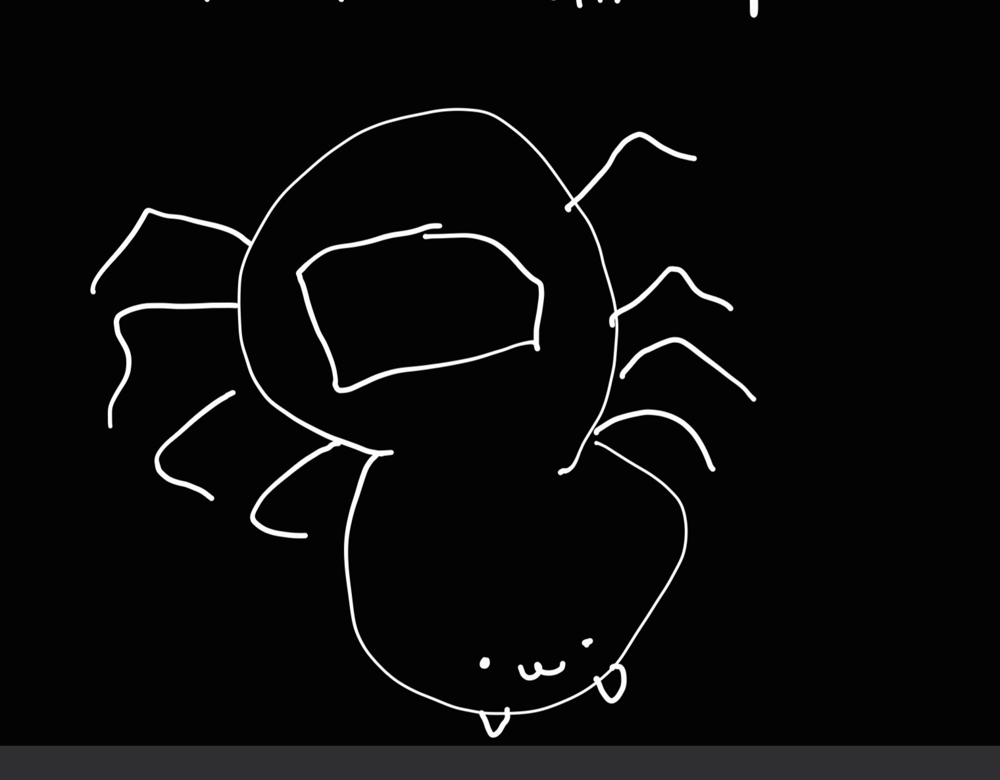

# Tarantula.Thermometer
Tarantula-shaped thermometer for my 2 pet trantulas
One day I noticed a problem, I had gotten my two curly hair tarantulas late last year. However, tarantulas are very sensitive to temperature change, so the problem was that my house could get really hot, which could be a problem for my spiders. My solution was that I would add ice bags, wrap them in towels and put them in a cooler with my spiders. This way, I could put a thermometer in the cooler and adjust the number of ice bags as needed. There was just one problem: I could not track the temperature of the soil itself, which was the thing that really mattered. 
This project was my solution, I would make a tarantula shaped thermometer with probes so I could stick them into the soil to measure the temperature.

